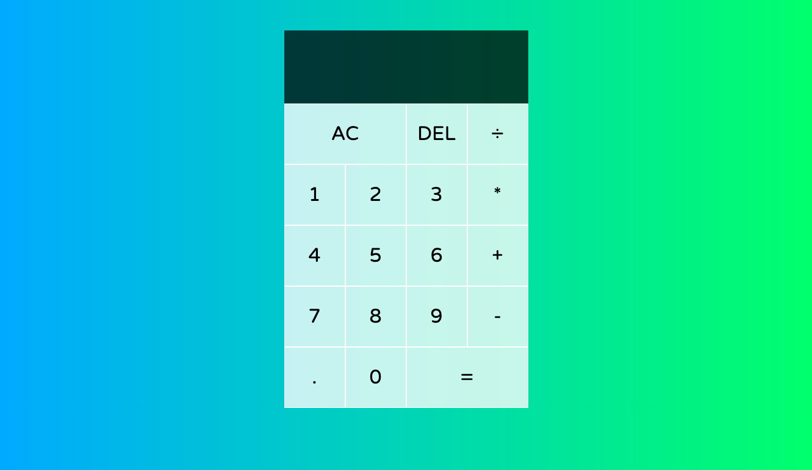

# JavaScript Calculator 

## License
No license in place

   
## Description
This is a calculator created using HTML, CSS, and vanilla JavaScript.

## Deployed Application
https://ssbbgm.github.io/javascript-calculator/

## Table of Contents

- [License](#license)
- [Description](#description)
- [Deployed Application](#deployed-application)
- [Installation](#installation)
- [Usage](#usage)
- [Visuals](#visuals)
- [Tests](#tests)
- [Contributors](#contributors)
- [Contact](#contact)

## Installation
None.

## Usage
To count all your money!

## Visuals

## Tests

No.

## Contributors

Sherreka S. Burton

## Contact

If you have any questions about this project please contact: Sherreka S. Burton

Github: [ssbbgm](http://github.com/ssbbgm)

Email: ssburto825@gmail.com
